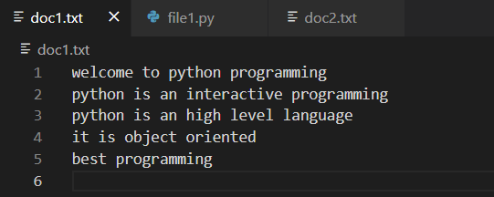
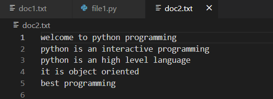
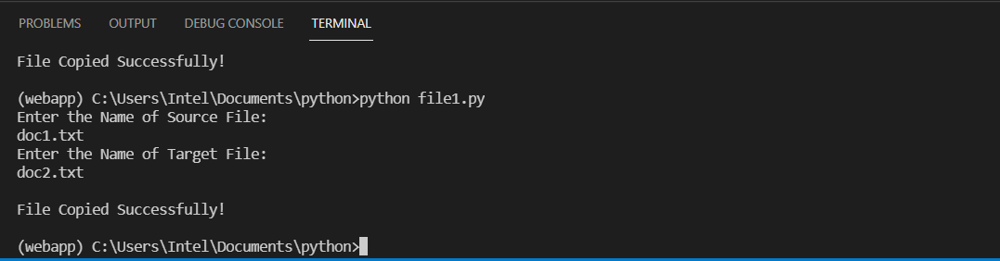

# copy-file
## AIM:
To write a python program for copying the contents from one file to another file.
## EQUIPEMENT'S REQUIRED: 
PC
Anaconda - Python 3.7
## ALGORITHM: 
### Step 1:
Create a new file with .py extension in your folder.
### Step 2: 
Create two .text type of file for copying contents .
### Step 3: 
Enter the code.
### Step 4:  
Run the code in the terminal.
### Step 5: 
Enter the source file and target file name.
### Step 6: 
Texts in source file are copied to the target file. End the program.
## PROGRAM:
~~~
#program for copying the contents
#Developed by: K.Balaji
#RegisterNumber: 21005757

print("Enter the Name of Source File: ")
sFile = input()
print("Enter the Name of Target File: ")
tFile = input()

fileHandle = open(sFile, "r")
texts = fileHandle.readlines()
fileHandle.close()

fileHandle = open(tFile, "w")
for s in texts:
    fileHandle.write(s)
fileHandle.close()

print("\nFile Copied Successfully!")
~~~
### OUTPUT:

### OUTPUT FOR THE PROGRAM:

### OUTPUT FOR doc1 and doc2:

### OUTPUT FOR THE TEMINAL:

## RESULT:
Thus the program is written to copy the contents from one file to another file.